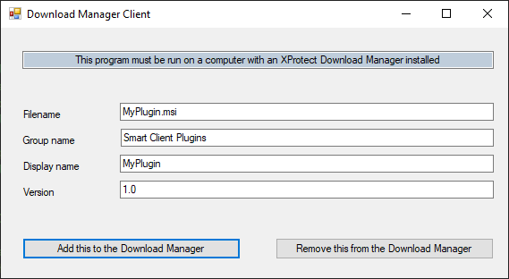
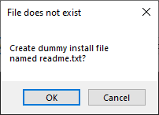
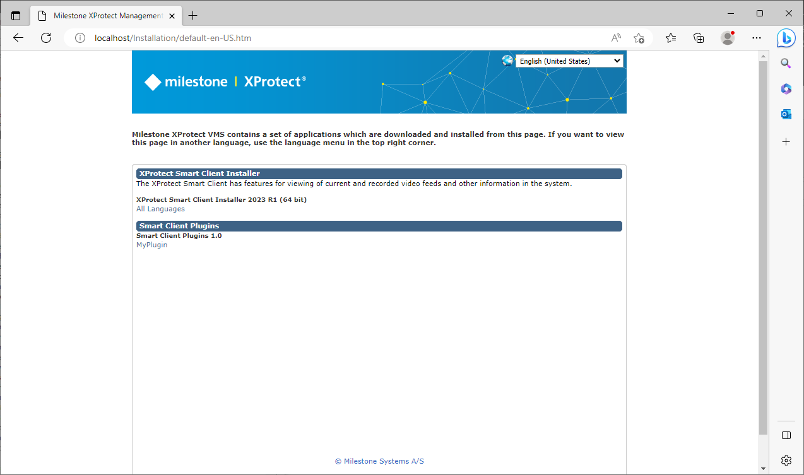

# Download Manager Client

The Download Manager Client shows how you can add and remove installers or other files 
such as tools and plug-ins to the download page.

The sample references 3 SSCM dlls (`SSCM.dll`, `SSCM.Interface.dll` and `SSCM.Interface.Retriever.dll`)
from a default XProtect Download Manager path (`C:\Program Files\Milestone\XProtect Download Manager`).
If your installation path is different or if you build the sample on a machine with no XProtect Download
Manager installed, you need to manually update those references to point to correct files.

Before you run the application, you need to copy the `.exe` output file to the XProtect Download Manager
installation folder and run it from there. 
You will not be able to add or remove items from the download page if you run your application
from another location.

Run the sample as Administrator. The following dialog is displayed:

Even though we don\'t have a \'MyPlugin.msi\' installer file in this
sample, we can still press the **Add this \...** button and will see
this dialog:

Press **OK**:

The dummy text file has been added to the download page.

Further maintenance can be done in the Download Manager application.
This tool can be started by clicking on Open Download Manager button, or by selecting it in the
\"Start \> Milestone \> XProtect Download Manager\".

In Download Manager application you can remove and add features available for
download. If you deselect a program or feature, it will remain installed on
the server, but not available for download.

The `http://localhost/installation` page would now look like this:

## The sample demonstrates

- How to add a Smart Client plugin to the download page

## Using

- SSCM
- SSCM.Interface
- SSCM.Interface.Retriever

## Environment

- None

## Visual Studio C\# project

- [DownloadManagerClient.csproj](javascript:clone('https://github.com/milestonesys/mipsdk-samples-component','src/ComponentSamples.sln');)
