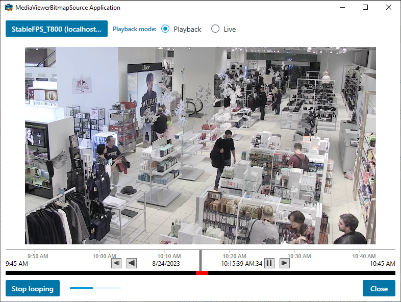

# Media Viewer BitmapSource

The Media Viewer shows how to use the Media toolkit for retrieving live
and stored video.

Login to XProtect happens when the application starts. Use the "select camera" button to select a camera. To select another camera, simply click on the button again. 

With the radio buttons, you choose whether to browse playback footage or
see live streaming from the camera. Depending on this choice, the
time-line (PlaybackWpfUserControl) will be enabled or disabled. This control, similarly to the time-line control of the Smart
Client, allows the user to handle playback.

The loop button illustrates how to implement a looping playback
behavior. The loop button is only enabled while browsing playback footage.

## The sample demonstrates

- Use of media toolkit BitmapSource
- Use of PlaybackWpfUserControl to control playback
- Handling of threads while using media toolkit and UI forms controls

## Using

- VideoOS.Platform.Client.BitmapSource
- VideoOS.Platform.Client.PlaybackController
- VideoOS.Platform.Client.PlaybackWpfUserControl

## Environment

- .NET library MIP Environment

## Visual Studio C\# project

- [MediaViewerBitmapSource.csproj](javascript:clone('https://github.com/milestonesys/mipsdk-samples-component','src/ComponentSamples.sln');)
