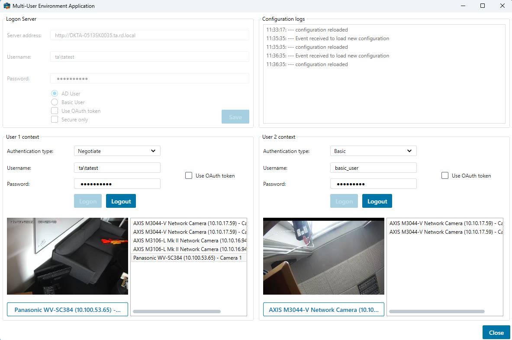

# Multi-User Environment

When the same set of XProtect servers needs to be accessed by multiple
different users through the same application, a UserContext class can be
utilized for separating each user\'s configuration and logon.

This can be useful e.g. when you are making a server service that
provide some web service support for many users.

Each user can login and have a different view of the configuration,
depending on access rights, while still maintaining login credentials
and token separately.

For information about login, please refer to <a href="https://doc.developer.milestonesys.com/html/index.html?base=gettingstarted/intro_environments_login.html&tree=tree_4.html" target="_top">Introduction to MIP Environments and Login</a>

In this application, you first initialize the environment with the selected XProtect server.  
Afterwards, you can log in as two different users to the defined server.  
Login can be performed as an Active Directory (AD) user, a basic user, or an external provider user.

After a user logs in, the list of cameras accessible to that user is displayed in a list box. If the server is part of a Milestone Federated Architecture hierarchy,  
cameras from child sites will also be listed. 
The user can also select a camera and view the live video stream from that camera.

## Authentication Types

The sample supports the following authentication methods:

- **Basic**
- **Negotiate**
- **External**

### Basic and Negotiate Authentication

These methods require a username and password:

- **Basic**: Uses basic user credentials.
- **Negotiate**: Uses Active Directory (AD) credentials.

If the **Use OAuth token** option is selected, the sample will first obtain an OAuth token for the user. This token is then used to authenticate the user with the XProtect server.

### External Authentication

This method enables users to authenticate with the XProtect server using an OAuth token issued by an external identity provider.  
Refer to the **OAuth login flow sample** for instructions on retrieving a token for external users.

> **Note:** Authentication types are defined in `VideoOS.Platform.Login.AuthenticationType`.

## The sample demonstrates

- How a single instance of the .NET Library can hold multiple users\' configuration at one time
- Login with AD and basic users with OAuth tokens or legacy functionality
- Login with users authenticated through external identity providers

## Using

- VideoOS.Platform.SDK.MultiUserEnvironment
- VideoOS.Platform.Live.JPEGLiveSource

## Environment

- .NET library MIP Environment

## Visual Studio C\# project

- [MultiUserEnvironment.csproj](javascript:clone('https://github.com/milestonesys/mipsdk-samples-component','src/ComponentSamples.sln');)
