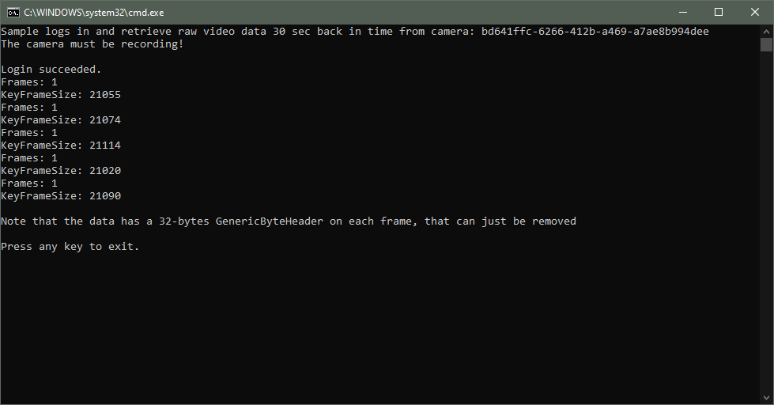

# Raw video source retriever

This sample shows how to retrieve raw video data in `GenericByteData` format from
a recording device, using a `RawVideoSource`. This is useful for example for
analytics applications.

To make the code as simple as possible, while still demonstrating the key concepts,
the sample is a console application.

## Prerequisites

You must set `CameraId` in the sample source code to a valid camera ID.

Here are some of the ways to quickly get the ID of a specific camera.

Using Management Client:

1. In the **Site Navigation** pane, select **Servers** and then select the recording server.
2. Select the relevant camera in the **Overview** pane.
3. Select the **Info** tab in the **Properties** pane.
4. Ctrl+Click the video image in the **Preview** pane.  
   The camera ID will be displayed at the bottom of the **Properties** pane.

Using the Config API Client sample:

1. Build the `ConfigAPIClient` project.
2. Run the `ConfigAPIClient` application and log in to the XProtect VMS.
3. In the tree view pane, find and select the relevant camera under **Camera groups**.
4. Select the **Camera** tab in the properties pane.  
   The camera ID is displayed at the top.

## The sample demonstrates

The application logs in using current Windows user credentials (unless you change
the `Login()` method). It creates a `RawVideoSource` from the camera GUID,
retrieves a recorded frame or GOP 30 s back in time as a `RawVideoSourceDataList`,
and then retrieves some subsequent frames or GOPs as `RawVideoSourceDataList`.

## Using

- VideoOS.Platform.Data
- VideoOS.Platform.SDK.Platform
- VideoOS.Platform.SDK.Export

## Environment

- MIP .NET library

## Visual Studio C\# project

- [RawVideoSourceRetriever.csproj](javascript:clone('https://github.com/milestonesys/mipsdk-samples-component','src/ComponentSamples.sln');)
